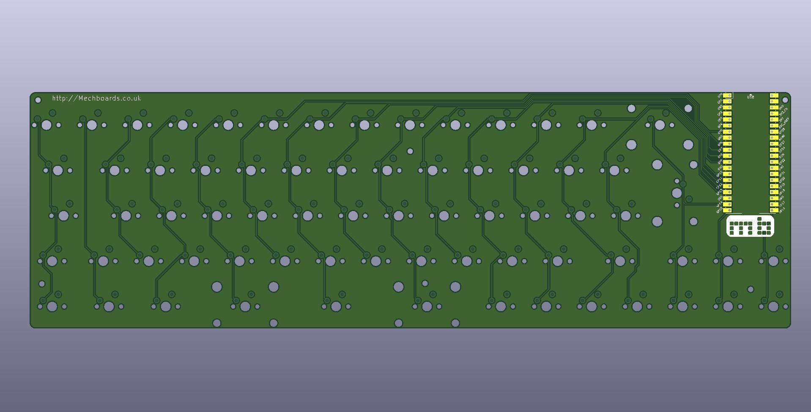

# Env-KB65M
 A 65% Custom Mechanical Keyboard.
 
 Project Name: KB65M
 Nickname:
  
### About
A compact 65% design featuring ISO and ANSI layout support as well as a triple split spacebar.

### Firmware
There is a zip in the _firmware folder to be used with circuitpython 6.3.0 which you can extract to the root directory of your pico once circuitpython is flashed.

If you are looking for QMK you can find the code [here](https://github.com/Envious-Data/EnvKB-QMK), this repo is meant to be used with [KarlK90's branch of QMK](https://github.com/KarlK90/qmk_firmware/tree/feature/raspberry-pi-rp2040-support).

###where to buy
[Mechboards UK](http://Mechboards.co.uk)

